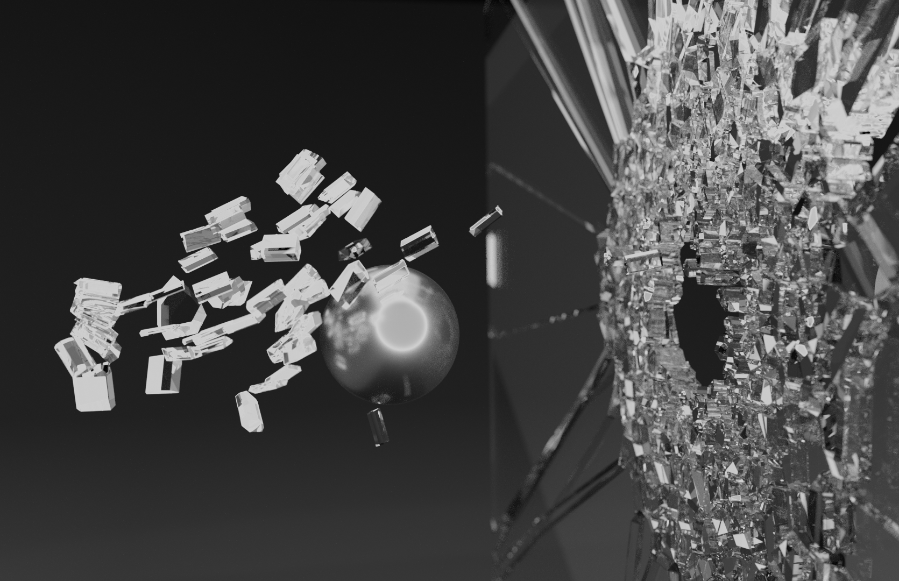
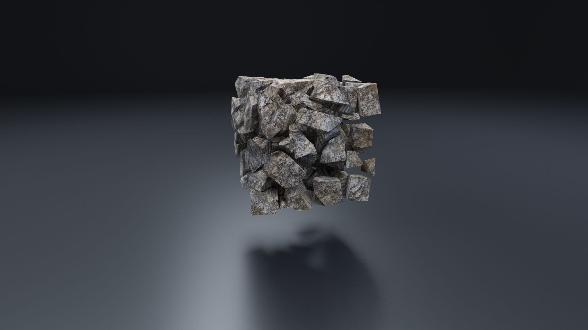

# Voronoi Fracture

## Command Flags

The `voronoiFracture` command has the following optional flags:

| Flag             | Short Flag | Type     | Default |
|------------------|------------|----------|---------|
| `-num_fragments` | `-nf`      | Unsigned | 5       |
| `-delete_object` | `-do`      | Boolean  | True    |
| `-curve_radius`  | `-cr`      | Double   | 0.1     |
| `-disk_axis`     | `-da`      | String   | ""      |
| `-steps`         | `-s`       | Unsigned | 0       |
| `-step_noise`    | `-sn`      | Double   | 0.05    |
| `-min_distance`  | `-md`      | Double   | 0.01    |

## Renders

