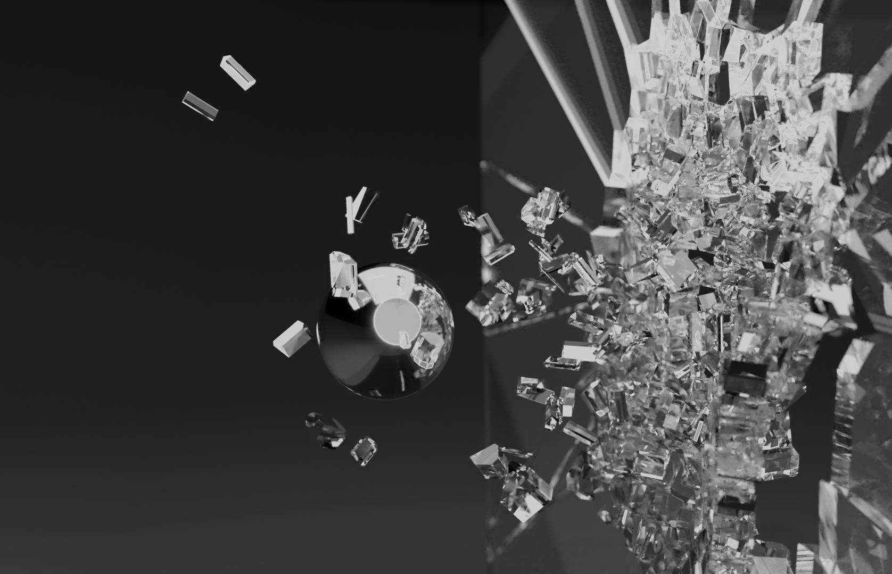

# Voronoi Fracture
This is a Maya plugin that fractures objects with a base in Voronoi partitioning. With a focus on being able to further simulate the breaking of different materials, the plugin utilises a range of built-in features in Maya to create versatile breaking behaviors such as distributions using bounding boxes, spheres, disks, hand-drawn curves or particle systems.

The project was implemented over a time frame of 6 weeks during the fall of 2020 as part of the course <a href="https://liu.se/studieinfo/kurs/tncg13/ht-2018">SFX - Tricks of the trade</a> at Linköping University. 

## Command Flags
The `voronoiFracture` command has the following optional flags:

| Flag             | Short Flag | Type     | Default |
|------------------|------------|----------|---------|
| `-num_fragments` | `-nf`      | Unsigned | 5       |
| `-delete_object` | `-do`      | Boolean  | True    |
| `-curve_radius`  | `-cr`      | Double   | 0.1     |
| `-disk_axis`     | `-da`      | String   | ""      |
| `-steps`         | `-s`       | Unsigned | 0       |
| `-step_noise`    | `-sn`      | Double   | 0.05    |
| `-min_distance`  | `-md`      | Double   | 0.01    |

## Renders

Plane fractured using 400 fragments and an implicit sphere to distribute the cells around one impact point. Render from frame in a rigid-body simulation simulating a bullet hitting a glass window.

Cube fractured with 100 fragments.

Plane fractured with 1000 fragments using a curve drawn on the object to distribute seed-points along. Fracture propagation using rigid-body simulation in order to simulate termal cracking of asphalt.

